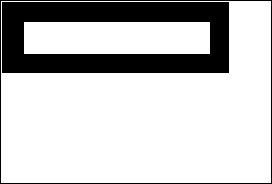

In 4D, data are handled according to their type in two places: database fields and the 4D language.

Although they are usually equivalent, some data types available at the database level are not directly available in the language and are automatically converted. Conversely, some data types can only be handled through the language. The following table lists all available data types and how they are supported/declared:

|Data Types	|Database support(*)	|Language support|Variable declaration  |
|---|----|---|---|
|Alpha	|Yes	|Converted to text|-
|Text	|Yes	|Yes|C_TEXT, ARRAY TEXT
|Date	|Yes	|Yes|C_DATE, ARRAY DATE
|Time	|Yes	|Yes|C_TIME, ARRAY TIME
|Boolean	|Yes	|Yes|C_BOOLEAN, ARRAY BOOLEAN
|Integer	|Yes	|Converted to longint|ARRAY INTEGER
|Longint	|Yes	|Yes|C_LONGINT, ARRAY LONGINT
|Longint 64 bits	|Yes (SQL)	|Converted to real|-
|Real	|Yes	|Yes|C_REAL, ARRAY REAL
|Float	|Yes (SQL)	|Converted to real|-
|Undefined	|-	|Yes|-
|Null	|-	|Yes|-
|Pointer	|-	|Yes|C_POINTER, ARRAY POINTER
|Picture	|Yes	|Yes|C_PICTURE, ARRAY PICTURE
|BLOB	|Yes	|Yes|C_BLOB, ARRAY BLOB
|Object	|Yes	|Yes|C_OBJECT, ARRAY OBJECT
|Collection	|-	|Yes|C_COLLECTION

(*)Note that ORDA handles database fields through objects (entities) and thus, only support data types available to these objects. For more information, see the Object data type description. 

## String

String is a generic term that stands for:

- Text fields or variables: a Text field, variable, or expression may contain from 0 to 2 GB of text.
- Alphanumeric fields: an Alphanumeric field may contain from 0 to 255 characters (limit set when field is defined).

### String literals

A string literal is enclosed in double, straight quotation marks ("…"). Here are some examples of string literals:

```
"Add Records"
"No records found."
"Invoice"
```

An empty string is specified by two quotation marks with nothing between them ("").

### String operators

|Operation	|Syntax	|Returns	|Expression	|Value|
|---|---|---|---|---|
|Concatenation	|String + String	|String	|"abc" + "def"	|"abcdef"|
|Repetition	|String * Number	|String 	|"ab" * 3	|"ababab"|
|Equality	|String = String	|Boolean	|"abc" = "abc"	|True|
|		|	||"abc" = "abd"	|False|
|Inequality	|String # String	|Boolean	|"abc" # "abd"	|True|
|			|||"abc" # "abc"	|False|
|Greater than	|String > String	|Boolean 	|"abd" > "abc"	|True
|			|||"abc" > "abc"	|False|
|Less than	|String < String	|Boolean	|"abc" < "abd"	|True|
|			|||"abc" < "abc"	|False|
|Greater than or equal to	|String >= String	|Boolean 	|"abd" >= "abc"	|True|
|			|||"abc" >= "abd"	|False|
|Less than or equal to	|String <= String	|Boolean 	|"abc" <= "abd"	|True|
|			|||"abd" <= "abc"	|False|
|Contains keyword	|String % String	|Boolean 	|"Alpha Bravo" % "Bravo"	|True|
|			|||"Alpha Bravo" % "ravo"	|False|
|	|Picture % String	|Boolean	|Picture_expr % "Mer"	|True (*)|

(*) If the keyword "Mer" is associated with the picture stored in the picture expression (field or variable).

#### More about string comparisons 

- Strings are compared on a character-by-character basis (except in the case of searching by keywords, see below).

- When strings are compared, the case of the characters is ignored; thus, "a"="A" returns TRUE. To test if the case of two characters is different, compare their character codes. For example, the following expression returns FALSE:

```
Character code("A")=Character code("a") // because 65 is not equal to 97
```
- When strings are compared, diacritical characters are compared using the system character comparison table of your computer. For example, the following expressions return TRUE:

```
     "n"="ñ"
     "n"="Ñ"
     "A"="å"
      // and so on
```
- Unlike other string comparisons, searching by keywords looks for “words” in “texts”: words are considered both individually and as a whole. The % operator always returns False if the query concerns several words or only part of a word (for example, a syllable). The “words” are character strings surrounded by “separators,” which are spaces and punctuation characters and dashes. An apostrophe, like in “Today's”, is usually considered as part of the word, but will be ignored in certain cases (see the rules below). Numbers can be searched for because they are evaluated as a whole (including decimal symbols). Other symbols (currency, temperature, and so on) will be ignored.

```
     "Alpha Bravo Charlie"%"Bravo" // Returns True
     "Alpha Bravo Charlie"%"vo" ` Returns False
     "Alpha Bravo Charlie"%"Alpha Bravo" // Returns False
     "Alpha,Bravo,Charlie"%"Alpha" // Returns True
     "Software and Computers"%"comput@" // Returns True
```

>**Notes:**
>- 4D uses the ICU library for detecting keywords. For more information about the rules implemented, please refer to the following address: http://www.unicode.org/unicode/reports/tr29/#Word_Boundaries.
>- In the Japanese version, instead of ICU, 4D uses Mecab by default for detecting keywords. For more information, please refer to .

- The wildcard character (@) can be used in any string comparison to match any number of characters. For example, the following expression is TRUE:

```
"abcdefghij"="abc@"
```

The wildcard character must be used within the second operand (the string on the right side) in order to match any number of characters. The following expression is FALSE, because the @ is considered only as a one character in the first operand:

```
     "abc@"="abcdefghij"
```

The wildcard means “one or more characters or nothing”. The following expressions are TRUE:

```
     "abcdefghij"="abcdefghij@"
     "abcdefghij"="@abcdefghij"
     "abcdefghij"="abcd@efghij"
     "abcdefghij"="@abcdefghij@"
     "abcdefghij"="@abcde@fghij@"
```

On the other hand, whatever the case, a string comparison with two consecutive wildcards will always return FALSE. The following expression is FALSE:

```
"abcdefghij"="abc@@fg"
```

When the comparison operator is or contains a < or > symbol, only comparison with a single wildcard located at the end of the operand is supported:

```
     "abcd"<="abc@" // Valid comparison
     "abcd"<="abc@ef" //Not a valid comparison
```

**Tip:** If you want to execute comparisons or queries using @ as a character (and not as a wildcard), you have two options:

- Use the (At sign) instruction. Imagine, for example, that you want to know if a string ends with the @ character.
The following expression (if $vsValue is not empty) is always TRUE:

```
($vsValue≤Length($vsValue)≥="@")
```

The following expression will be evaluated correctly:

```
(Character code($vsValue≤Length($vsValue)≥)#64)  
```

- Use the "Consider @ as a wildcard only when at the beginning or end of text patterns" option which can be accessed using the Database Settings dialog box.
    This option lets you define how the @ character is interpreted when it is included in a character string. As such, it can influence how comparison operators are used in Query or Order By. For more information, refer to the 4D Design Reference manual.
    
### Character Reference Symbols  
The character reference symbols: [[...]]

These symbols are used to refer to a single character within a string. This syntax allows you to individually address the characters of a text variable, string variable, or field.

If the character reference symbols appear on the left side of the assignment operator (:=), a character is assigned to the referenced position in the string. For example, if vsName is not an empty string, the following line sets the first character of vsName to uppercase:

```
If(vsName#"")
    vsName[[1]]:=Uppercase(vsName[[1]])
End if
```

Otherwise, if the character reference symbols appear within an expression, they return the character (to which they refer) as a 1-character string. For example:

```
//The following example tests if the last character of vtText is an At sign "@"
 If(vtText#"")
    If(Character code(Substring(vtText;Length(vtText);1))=At sign)
  //...
    End if
 End if
 
  //Using the character reference syntax, you would write in a simpler manner:
 If(vtText#"")
    If(Character code(vtText[[Length(vtText)]])=At sign)
  // ...
    End if
 End if
```

#### Advanced note about invalid character reference 

When you use the character reference symbols, you must address existing characters in the string in the same way you address existing elements of an array. For example if you address the 20th character of a string variable, this variable MUST contain at least 20 characters.

- Failing to do so, in interpreted mode, does not cause a syntax error.
- Failing to do so, in compiled mode (with no options), may lead to memory corruption, if, for instance, you write a character beyond the end of a string or a text.
- Failing to do so, in compiled mode, causes an error with the option Range Checking On. For example, executing the following code:

```
//Very bad and nasty thing to do, boo!
 vsAnyText:=""
 vsAnyText[[1]]:="A"
```

will trigger the Runtime Error shown here:


#### Example 


The following project method capitalizes the first character of each word of the text received as parameter and returns the resulting capitalized text:

```
  //Capitalize_text project method
  //Capitalize_text ( Text ) -> Text
  //Capitalize_text ( Source text ) -> Capitalized text
 
 $0:=$1
 $vlLen:=Length($0)
 If($vlLen>0)
    $0[[1]]:=Uppercase($0[[1]])
    For($vlChar;1;$vlLen-1)
       If(Position($0[[$vlChar]];" !&()-{}:;<>?/,.=+*")>0)
          $0[[$vlChar+1]]:=Uppercase($0[[$vlChar+1]])
       End if
    End for
 End if
```

For example, the line:

```
ALERT(Capitalize_text("hello, my name is jane doe and i'm running for president!"))
```

displays the alert shown here:


## Date

- A Date field, variable or expression can be in the range of 1/1/100 to 12/31/32,767.
- Using the US English version of 4D, a date is ordered month/day/year.
- If a year is given as two digits, it is assumed to be in the 1900’s if the value is greater than or equal to 30, and the 2000’s if the value is less than 30 (this default can be changed using the command).
- Although the representation mode for dates by can work with dates up to the year 32 767, certain operations passing through the system impose a lower limit.  

**Note:** In the 4D Language Reference manual, Date parameters in command descriptions are denoted as Date, except when marked otherwise.  

### Date Constants  

A date constant is enclosed by exclamation marks (!…!). Since 4D v15, a date must be structured using the ISO format (!YYYY-MM-DD!). Here are some examples of date constants:

```
!1976-01-01!
!2004-09-29!
!2015-12-31!
```

A null date is specified by _!00-00-00!_.

**Tip:** The Method Editor includes a shortcut for entering a null date. To type a null date, enter the exclamation (!) character and press Enter.

**Notes:**

- For compatibility reasons, 4D accepts two-digit years to be entered. A two-digit year is assumed to be in the 20th or 21st century based on whether it is greater or less than 30, unless this default setting has been changed using the command.
- If you have checked the "Use regional system settings" option (see Methods Page), you must use the date format defined in your system. Generally, in a US environment, dates are entered in the form month/day/year, with a slash "/" separating the values.
    
### Date operators 

|Operation	|Syntax	|Returns	|Expression	|Value|
|---|---|---|---|---|
|Date difference	|Date – Date	|Number	|!1997-01-20! - !1997-01-01!	|19|
Day addition	|Date + Number	|Date	|!1997-01-20! + 9	|!1997-01-29!|
Day subtraction	|Date – Number	|Date	|!1997-01-20! - 9	|!1997-01-11!|
Equality	|Date = Date	|Boolean	|!1/1/97! =!1/1/97!	|True|
		||	||!1/20/97! =!1/1/97!	|False|
Inequality	|Date # Date	|Boolean	|!1/20/97! # !1/1/97!	|True|
			||||!1/1/97! # !1/1/97!	|False|
Greater than	|Date > Date	|Boolean	|!1/20/97! > !1/1/97!	|True|
			||||!1/1/97! > !1/1/97!	|False|
Less than	|Date < Date	|Boolean	|!1/1/97! < !1/20/97!	|True|
			||||!1/1/97! < !1/1/97!	|False|
Greater than or equal to	|Date >= Date	|Boolean	|!1/20/97! >=!1/1/97!	|True|
			||||!1/1/97!>=!1/20/97!	|False|
Less than or equal to	|Date <= Date	|Boolean	|!1/1/97!<=!1/20/97!|	True|
		||||	!1/20/97!<=!1/1/97!|	False|

## Time

- A Time field, variable or expression can be in the range of 00:00:00 to 596,000:00:00.
- Using the US English version of 4D, time is ordered hour:minute:second.
- Times are in 24-hour format.
- A time value can be treated as a number. The number returned from a time is the number of seconds that time represents. For more information, see the section Time Operators.

**Note:** In the 4D Language Reference manual, Time parameters in command descriptions are denoted as Time, except when marked otherwise.  
    
### Time Constants  

A time constant is enclosed by question marks (?...?).

In the US English version of 4D, a time constant is ordered hour:minute:second, with a colon (:) setting off each part. Times are specified in 24-hour format.

Here are some examples of time constants:

```
?00:00:00? ` midnight
?09:30:00? ` 9:30 am
?13:01:59? ` 1 pm, 1 minute, and 59 seconds
```

A null time is specified by ?00:00:00?

**Tip:** The Method Editor includes a shortcut for entering a null time. To type a null time, enter the question mark (?) character and press Enter.
    
### Time operators 

|Operation	|Syntax	|Returns	|Expression	|Value|
|---|---|---|---|---|
|Addition	|Time + Time	|Time	|?02:03:04? + ?01:02:03?	|?03:05:07?|
Subtraction	|Time – Time	|Time	|?02:03:04? – ?01:02:03?	|?01:01:01?|
Addition	|Time + Number	|Number	|?02:03:04? + 65	|7449|
Subtraction	|Time – Number	|Number	|?02:03:04? – 65	|7319|
Multiplication	|Time * Number	|Number	|?02:03:04? * 2	|14768|
Division	|Time / Number	|Number	|?02:03:04? / 2	|3692|
Longint division	|Time \ Number	|Number	|?02:03:04? \ 2	|3692|
Modulo	|Time % Time	|Time	|?20:10:00? % ?04:20:00?	|?02:50:00?|
Modulo	|Time % Number	|Number	|?02:03:04? % 2	|0|
Equality	|Time = Time	|Boolean	|?01:02:03? = ?01:02:03?	|True|
			||||?01:02:03? = ?01:02:04?	|False|
Inequality	|Time # Time	|Boolean	|?01:02:03? # ?01:02:04?	|True|
			||||?01:02:03? # ?01:02:03?	|False|
Greater than	|Time > Time	|Boolean	|?01:02:04? > ?01:02:03?	|True|
	||||		?01:02:03? > ?01:02:03?	|False|
Less than	|Time < Time	|Boolean	|?01:02:03? < ?01:02:04?	|True|
		||||	?01:02:03? < ?01:02:03?	|False|
Greater than or equal to	|Time >= Time	|Boolean	|?01:02:03? >=?01:02:03?	|True|
			||||?01:02:03? >=?01:02:04?	|False|
Less than or equal to	|Time <= Time	|Boolean	|?01:02:03? <=?01:02:03?|	True|
			||||?01:02:04? <=?01:02:03?	|False|

#### Example 1 

To obtain a time expression from an expression that combines a time expression with a number, use the commands Time and Time string.

You can combine expressions of the time and number types using the or functions. For example:

```
  //The following line assigns to $vlSeconds the number of seconds that will be elapsed between midnight and one hour from now
 $vlSeconds:=Current time+3600
  //The following line assigns to $vHSoon the time it will be in one hour
 $vhSoon:=Time(Current time+3600)
```

The second line could be written in a simpler way:

```
  // The following line assigns to $vHSoon the time it will be in one hour
 $vhSoon:=Current time+?01:00:00?
```

#### Example 2

Some situations may require you to convert a time expression into a numeric expression.
For example, you open a document using , which returns a Document Reference (DocRef) that is formally a time expression. Later, you want to pass that DocRef to a 4D Extension routine that expects a numeric value as document reference. In such a case, use the addition with 0 (zero) to get a numeric value from the time value, but without changing its value.

```
//Select and open a document
 $vhDocRef:=Open document("")
 If(OK=1)
//Pass the DocRef time expression as a numeric expresssion to a 4D Extension routine
    DO SOMETHING SPECIAL(0+$vhDocRef)
 End if
```

#### Example 3

The Modulo operator can be used, more specifically, to add times that take the 24-hour format into account:

```
$t1:=?23:00:00? // It is 23:00 p.m.
  // We want to add 2 and a half hours
$t2:=$t1 +?02:30:00? // With a simple addition, $t2 is ?25:30:00?
$t2:=($t1 +?02:30:00?)%?24:00:00? // $t2 is ?01:30:00? and it is 1:30 a.m. the next morning
```

## Numbers (Real, Integer)

Number is a generic term that stands for:

- Real field, variable or expression. The range for the Real data type is ±1.7e±308 (13 significant digits). 
- Long Integer field, variable or expression. The range for the Long Integer data type (4-byte Integer) is -2^31..(2^31)-1. 
- Integer field, array or expression. The range for the Integer data type (2-byte Integer) is -32,768..32,767 (2^15..(2^15)-1).

**Note:** Integer field values are automatically converted in Long integers when used in the 4D Language.

You can assign any Number data type to another; 4D does the conversion, truncating or rounding if necessary. However, when values are out of range, the conversion will not return a valid value. You can mix Number data types in expressions.

**Note:** In the 4D Language Reference manual, no matter the actual data type, the Real, Integer, and Long Integer parameters in command descriptions are denoted as number, except when marked otherwise.

    
### Number Constants   

A numeric constant is written as a real number. Here are some examples of numeric constants:

```
27
123.76
0.0076
```

**Note:** Since 4D v15, the default decimal separator is a period (.), regardless of the system language. If you have checked the "Use regional system settings" option (see Methods Page), you must use the separator defined in your system.

Negative numbers are specified with the minus sign (-). For example:

```
-27
-123.76
-0.0076
```
 
### Number operators 

|Operation	|Syntax	|Returns	|Expression	|Value|
|---|---|---|---|---|
|Addition	|Number + Number	|Number	|2 + 3	|5|
Subtraction	|Number - Number	|Number	|3 – 2	|1|
Multiplication	|Number * Number	|Number	|5 * 2	|10|
Division	|Number /Number	|Number	|5 / 2	|2.5|
Longint division	|Number \ Number	|Number	|5 \ 2	|2|
Modulo	|Number % Number	|Number	|5 % 2	|1|
Exponentiation	|Number ^ Number	|Number	|2 ^ 3|	8|
Equality	|Number = Number	|Boolean	|10 = 10	|True|
			||||10 = 11|	False|
Inequality	|Number # Number	|Boolean	|10 #11	|True|
			||||10 # 10	|False|
Greater than	|Number > Number	|Boolean	|11 > 10	|True|
			||||10 > 11	|False|
Less than	|Number < Number	|Boolean	|10 < 11	|True|
		||||	11 < 10	|False|
Greater than or equal to	|Number >= Number	|Boolean	|11 >= 10	|True|
			||||10 >= 11	|False|
Less than or equal to	|Number <= Number	|Boolean	|10 <= 11	|True|
		||||	11 <= 10	|False|

The modulo operator % divides the first number by the second number and returns a whole number remainder. Here are some examples:

- 10 % 2 returns 0 because 10 is evenly divided by 2.
- 10 % 3 returns 1 because the remainder is 1.
- 10.5 % 2 returns 0 because the remainder is not a whole number.

**WARNING:**
- The modulo operator % returns significant values with numbers that are in the Long Integer range (from minus 2^31 to 2^31 minus one). To calculate the modulo with numbers outside of this range, use the command.
- The longint division operator \ returns significant values with integer numbers only. 

#### Precedence

The order in which an expression is evaluated is called precedence. 4D has a strict left-to-right precedence, in which algebraic order is not observed. For example:

```
 3+4*5
```

returns 35, because the expression is evaluated as 3 + 4, yielding 7, which is then multiplied by 5, with the final result of 35.

To override the left-to-right precedence, you MUST use parentheses. For example:

```
 3+(4*5)
```

returns 23 because the expression (4 * 5) is evaluated first, because of the parentheses. The result is 20, which is then added to 3 for the final result of 23.

Parentheses can be nested inside other sets of parentheses. Be sure that each left parenthesis has a matching right parenthesis to ensure proper evaluation of expressions. Lack of, or incorrect use of parentheses can cause unexpected results or invalid expressions. Furthermore, if you intend to compile your applications, you must have matching parentheses—the compiler detects a missing parenthesis as a syntax error.


## Boolean

A boolean field, variable or expression can be either TRUE or FALSE.

### Boolean functions

4D provides the Boolean functions `True`, `False`, and `Not` in the dedicated **Boolean** theme. For more information, see the descriptions of these commands

#### Example

This example sets a Boolean variable based on the value of a button. It returns True in myBoolean if the myButton button was clicked and False if the button was not clicked. When a button is clicked, the button variable is set to 1.

```
 If(myButton=1) ` If the button was clicked
    myBoolean:=True ` myBoolean is set to True
 Else ` If the button was not clicked,
    myBoolean:=False ` myBoolean is set to False
 End if
```

The previous example can be simplified into one line.

```
myBoolean:=(myButton=1)
```

### Logical Operators

4D supports two logical operators that work on Boolean expressions: conjunction (AND) and inclusive disjunction (OR). A logical AND returns TRUE if both expressions are TRUE. A logical OR returns TRUE if at least one of the expressions is TRUE. The following table shows the logical operators:

|Operation	|Syntax	|Returns	|Expression	|Value|
|---|---|---|---|---|
|AND|Boolean & Boolean	|Boolean	|("A" = "A") & (15 # 3)	|True|
||||("A" = "B") & (15 # 3)	|False|
||||("A" = "B") & (15 = 3)	|False|
OR	|Boolean  &#124; Boolean	|Boolean	|("A" = "A") &#124; (15 # 3)	|True
||||("A" = "B") &#124;  (15 # 3)	|True|
||||("A" = "B") &#124;  (15 = 3)	|False|

The following is the truth table for the AND logical operator:

|Expr1	|Expr2	|Expr1 & Expr2|  
---|---|---|
|True	|True	|True|
|True	|False	|False|
|False	|True	|False|
|False	|False	|False|

The following is the truth table for the OR logical operator:

|Expr1	|Expr2	|Expr1 &#124; Expr2|
|---|---|---|
|True	|True	|True|
|True	|False	|True|
|False	|True	|True|
|False	|False	|False|

**Tip:** If you need to calculate the exclusive disjunction between Expr1 and Expr2, evaluate:

```
 (Expr1|Expr2) & Not(Expr1 & Expr2)  
```

## Null and Undefined

### Null
Null is a special data type with only one possible value: **null**. This value is returned by an expression that does not contain any value.

From the 4D database point of view, a null value expresses the fact that the data value is unknown. It does NOT mean that the value is blank, or empty ("" for a string, or 0 for a longint are blank values). In the 4D database, null values in fields (except for Object field attributes) are handled by the SQL engine only. A specific field option allows you to configure how the database should handle this value (`Map NULL values to blank values`) and you can set or read the null values using the `SET FIELD VALUE NULL` and `Is field value Null` commands.

In the 4D language and for object field attributes, null values are managed through the `Null` function. This function can be used with the following expressions for setting or comparing the null value:

- object attributes
- collection elements
- variables of the object, collection, pointer, or picture type.

### Undefined

Undefined is not actually a data type. It denotes a variable that has not yet been defined. A function (a project method that returns a result) can return an undefined value if, within the method, the function result ($0) is assigned an undefined expression (an expression calculated with at least one undefined variable). A field cannot be undefined (the `Undefined` command always returns False for a field).

### Examples 

Here are the different results of the `Undefined` command as well as the `Null` command with object properties, depending on the context:

```
C_OBJECT(vEmp)
vEmp:=New object
vEmp.name:="Smith"
vEmp.children:=Null
 
$undefined:=Null and Undefined(vEmp.name) // False
$null:=(vEmp.name=Null) //False
 
$undefined:=Null and Undefined(vEmp.children) // False
$null:=(vEmp.children=Null) //True
 
$undefined:=Null and Undefined(vEmp.parent) // True
$null:=(vEmp.parent=Null) //True
```

## Pointer

A Pointer variable or expression is a reference to another variable (including arrays and array elements), table, field, or object. There is no field of type Pointer.

Pointers provide an advanced way (in programming) to refer to data. When you use the language, you access various objects—in particular, tables, fields, variables, objects, and arrays—by simply using their names. However, it is often useful to refer to these elements and access them without knowing their names. This is what pointers let you do.

The concept behind pointers is not that uncommon in everyday life. You often refer to something without knowing its exact identity. For example, you might say to a friend, “Let’s go for a ride in your car” instead of “Let’s go for a ride in the car with license plate 123ABD.” In this case, you are referencing the car with license plate 123ABD by using the phrase “your car.” The phrase “car with license plate 123ABD” is like the name of an object, and using the phrase “your car” is like using a pointer to reference the object.

Being able to refer to something without knowing its exact identity is very useful. In fact, your friend could get a new car, and the phrase “your car” would still be accurate—it would still be a car and you could still take a ride in it. Pointers work the same way. For example, a pointer could at one time refer to a numeric field called Age, and later refer to a numeric variable called Old Age. In both cases, the pointer references numeric data that could be used in a calculation.

You can use pointers to reference tables, fields, variables, arrays, array elements, and objects. The following table gives an example of each data type:

|Type	|To Reference	|To Use	|To Assign|
|---|---|---|---|
|Table	|vpTable:=->[Table]	|DEFAULT TABLE(vpTable->)	|n/a|
|Field	|vpField:=->[Table]Field	|ALERT(vpField->)	|vpField->:="John"|
|Variable	|vpVar:=->Variable	|ALERT(vpVar->) 	|vpVar->:="John"
|Array	|vpArr:=->Array	|SORT ARRAY(vpArr->;>) 	|COPY ARRAY (Arr;vpArr->)
|Array element	|vpElem:=->Array{1}	|ALERT (vpElem->)	|vpElem->:="John"|
|Object	|vpObj:=->myObject	|ALERT (vpObj->myProp)	|vpObj->myProp:="John"|


### Using a pointer: Basic example

It is easiest to explain the use of pointers through an example. This example shows how to access a variable through a pointer. We start by creating a variable:

```
MyVar:="Hello"
```
MyVar is now a variable containing the string “Hello.” We can now create a pointer to MyVar:

```
MyPointer:=->MyVar
```
The -> symbol means “get a pointer to.” This symbol is formed by a dash followed by a “greater than” sign. In this case, it gets the pointer that references or “points to” MyVar. This pointer is assigned to MyPointer with the assignment operator.

MyPointer is now a variable that contains a pointer to MyVar. MyPointer does not contain “Hello”, which is the value in MyVar, but you can use MyPointer to get this value. The following expression returns the value in MyVar:
```
MyPointer->
```

In this case, it returns the string “Hello”. The -> symbol, when it follows a pointer, references the object pointed to. This is called dereferencing.

It is important to understand that you can use a pointer followed by the -> symbol anywhere that you could have used the object that the pointer points to. This means that you could use the expression MyPointer-> anywhere that you could use the original MyVar variable.

For example, the following line displays an alert box with the word Hello in it:
```
ALERT(MyPointer->)
```

You can also use MyPointer to change the data in MyVar. For example, the following statement stores the string "Goodbye" in the variable MyVar:
```
MyPointer->:="Goodbye"
```
If you examine the two uses of the expression MyPointer->, you will see that it acts just as if you had used MyVar instead. In summary, the following two lines perform the same action—both display an alert box containing the current value in the variable MyVar:

```
ALERT(MyPointer->)
ALERT(MyVar)
```
The following two lines perform the same action— both assign the string "Goodbye" to MyVar:
```
MyPointer->:="Goodbye"
MyVar:="Goodbye"
```

For more examples of use of pointers, please refer to the [Pointers page](pointers.md).

### Pointer operators

With:
```
  ` vPtrA and vPtrB point to the same object
 vPtrA:=->anObject
 vPtrB:=->anObject
  ` vPtrC points to another object
 vPtrC:=->anotherObject
```

|Operation	|Syntax	|Returns	|Expression	|Value|
|---|---|---|---|---|
|Equality	|Pointer = Pointer	|Boolean	|vPtrA = vPtrB	|True|
		|	|||vPtrA = vPtrC	|False|
|Inequality	|Pointer # Pointer	|Boolean	|vPtrA # vPtrC	|True|
||||			vPtrA # vPtrB	|False|

## Picture

A Picture field, variable or expression can be any Windows or Macintosh picture. In general, this includes any picture that can be put on the pasteboard or read from the disk using 4D or Plug-In commands.

### Native Formats Supported 

4D integrates native management of picture formats. This means that pictures will be displayed and stored in their original format, without any interpretation in 4D. The specific features of the different formats (shading, transparent areas, etc.) will be retained when they are copied and pasted, and will be displayed without alteration. This native support is valid for all pictures stored in 4D: library pictures, pictures pasted into forms in Design mode, pictures pasted into fields or variables in Application mode, etc.

4D uses native APIs to encode and decode pictures (fields and variables) under both Windows and macOS. These implementations provide access to numerous native forms, including the RAW format, currently used by digital cameras. 

- Under Windows, 4D uses WIC (Windows Imaging Component). WIC natively supports the following formats: BMP, PNG, ICO (decoding only), JPEG, GIF, TIFF and WDP (Microsoft Windows Digital Photo).    It is possible to use additional formats such as JPEG-2000 by installing third-party WIC codecs.
- Under macOS, 4D uses ImageIO. All the available ImageIO codecs are therefore natively supported for decoding (reading) as well as encoding (writing):

|Decoding|	Encoding|
|---|---|
|public.jpeg	|public.jpeg
|com.compuserve.gif	|com.compuserve.gif
|public.png	|public.png
|public.jpeg-2000	|public.jpeg-2000
|com.nikon.raw-image	|public.tiff
|com.pentax.raw-image	|com.adobe.photoshop.image
|com.sony.arw-raw-image	|com.adobe.pdf
|com.adobe.raw-image	|com.microsoft.bmp
|public.tiff com.canon.crw-raw-image	|com.truevision.tga-image
|com.canon.cr2-raw-image	|com.sgi.sgi-image
|com.canon.tif-raw-image	|com.apple.pict (deprecated)
|com.sony.raw.image	|com.ilm.openexr-image
|com.olympus.raw-image|
|com.konicaminolta.raw-image	|   
|com.panasonic.raw-image	 |  
|com.fuji.raw-image	   |
|com.adobe.photoshop-image	  | 
|com.adobe.illustrator.ai-image	 |  
|com.adobe.pdf	   |
|com.microsoft.ico	 |  
|com.microsoft.bmp	|   
|com.truevision.tga-image	 |  
|com.sgi.sgi-image	 |  
|com.apple.quicktime-image (deprecated)	  | 
|com.apple.icns	   |
|com.apple.pict (deprecated)	|   
|com.apple.macpaint-image|	   
|com.kodak.flashpix-image	|   
|public.xbitmap-image	|   
|com.ilm.openexr-image	|   
|public.radiance|	    

Under Windows as under macOS, the formats supported vary according to the operating system and the custom codecs that are installed on the machines. To find out which codecs are available, you must use the `PICTURE CODE LIST` command. 

**Note:** WIC and ImageIO permit the use of metadata in pictures. Two commands, `SET PICTURE METADATA` and `GET PICTURE METADATA`, let you benefit from metadata in your developments.

#### Picture Codec IDs

Picture formats recognized by 4D are returned by the `PICTURE CODE LIST` command as picture Codec IDs. They can be returned in the following forms:

- As an extension (for example “.gif”)
- As a Mime type (for example “image/jpeg”)

The form returned for each format will depend on the way the Codec is recorded at the operating system level.
Most of the 4D picture management commands can receive a Codec ID as a parameter. It is therefore imperative to use the system ID returned by the `PICTURE CODE LIST` command.

#### Unavailable picture format

A specific icon is displayed for pictures saved in a format that is not available on the machine. The extension of the missing format is shown at the bottom of the icon. The icon is automatically used wherever the picture is meant to be displayed:


This icon indicates that the picture cannot be displayed or manipulated locally -- but it can be saved without alteration so that it can be displayed on other machines. This is the case, for instance, for PDF pictures on Windows, or for pictures based on PICT displayed on a 64-bit 4D Server under macOS.

#### Activation of QuickTime (compatibility) 

By default, the picture codecs related to QuickTime are no longer supported in 4D beginning with v14.

For compatibility reasons, you can reactivate QuickTime in your application by means of the **QuickTime support** option of the command. However, we no longer recommend using QuickTime codecs.

**Note:** The QuickTime reactivation option is ignored in 64-bit versions of 4D Developer Edition (no QuickTime support).

### Picture Operators

|Operation	|Syntax	|Returns	|Action|
|---|---|---|---|
|Horizontal concatenation	|Pict1 + Pict2	|Picture	|Add Pict2 to the right of Pict1
|Vertical concatenation	|Pict1 / Pict2	|Picture	|Add Pict2 to the bottom of Pict1|
|Exclusive superimposition	|Pict1 & Pict2	|Picture	|Superimposes Pict2 on top of Pict1 (Pict2 in foreground). Produces the same result as `COMBINE PICTURES(pict3;pict1;Superimposition;pict2)`
|Inclusive superimposition	|Pict1 &#124; Pict2	|Picture	|Superimposes Pict2 on Pict1 and returns resulting mask if both pictures are the same size. Produces the same result as `$equal:=Equal pictures(Pict1;Pict2;Pict3)`|
Horizontal move	|Picture + Number	|Picture	|Move Picture horizontally Number pixels|
Vertical move	|Picture / Number	|Picture	|Move Picture vertically Number pixels|
Resizing	|Picture * Number	|Picture	|Resize Picture by Number ratio|
Horizontal scaling	|Picture *+ Number	|Picture	|Resize Picture horizontally by Number ratio|
Vertical scaling	|Picture */ Number	|Picture	|Resize Picture vertically by Number ratio|

**Notes :**  

- In order to use the | operator, Pict1 and Pict2 must have exactly the same dimension. If both pictures are a different size, the operation Pict1 | Pict2 produces a blank picture.
- The `COMBINE PICTURES` command can be used to superimpose pictures while keeping the characteristics of each source picture in the resulting picture.
- The picture operators return vectorial pictures if the two source pictures are vectorial. Remember, however, that pictures printed by the display format On Background are printed bitmapped.
- Additional operations can be performed on pictures using the `TRANSFORM PICTURE` command.
- There is no comparison operators on pictures, however 4D proposes the `Equal picture` command to compare two pictures. 
- 4D lets you retrieve the local coordinates of the mouse in a picture field or variable in case of a click or a hovering, even if a scroll or zoom has been applied to the picture. This mechanism, similar to that of a picture map, can be used, for example, to handle scrollable button bars or the interface of cartography software.
The coordinates are returned in the _MouseX_ and _MouseY_ **System Variables**. The coordinates are expressed in pixels with respect to the top left corner of the picture (0,0). If the mouse is outside of the picture coordinates system, -1 is returned in *MouseX* and _MouseY_. You can get the value of these variables as part of the **On Clicked**, **On Double Clicked**, **On Mouse up**, **On Mouse Enter**, or **On Mouse Move** form events.


#### Examples 

In the following examples, all of the pictures are shown using the display format **On Background**.

Here is the picture circle:


Here is the picture rectangle:


In the following examples, each expression is followed by its graphical representation.

Horizontal concatenation
```
 circle+rectangle ` Place the rectangle to the right of the circle
 rectangle+circle ` Place the circle to the right of the rectangle
```


Vertical concatenation
```
 circle/rectangle ` Place the rectangle under the circle
 rectangle/circle ` Place the circle under the rectangle
```


Exclusive superimposition
```
Pict3:=Pict1 & Pict2 // Superimposes Pict2 on top of  Pict1
```


Inclusive superimposition
```
Pict3:=Pict1|Pict2 // Recovers resulting mask from superimposing two pictures of the same size
```


Horizontal move
```
rectangle+50 ` Move the rectangle 50 pixels to the right
rectangle-50 ` Move the rectangle 50 pixels to the left
```

    
Vertical move

```
rectangle/50 ` Move the rectangle down by 50 pixels
rectangle/-20 ` Move the rectangle up by 20 pixels
```


Resize

```
rectangle*1.5 ` The rectangle becomes 50% bigger
rectangle*0.5 ` The rectangle becomes 50% smaller
```


Horizontal scaling

```
circle*+3 ` The circle becomes 3 times wider
circle*+0.25 ` The circle's width becomes a quarter of what it was
```


Vertical scaling

```
circle*/2 ` The circle becomes twice as tall
circle*/0.25 ` The circle's height becomes a quarter of what it was
```


## BLOB

A BLOB (Binary Large OBjects) field or variable is a contiguous series of bytes which can be treated as one whole object or whose bytes can be addressed individually. A BLOB can be empty (null length) or can contain up to 2147483647 bytes (2 GB). 


#### BLOBs and Memory
A BLOB is loaded into memory in its entirety. A BLOB variable or BLOB array is held and exists in memory only. A BLOB field is loaded into memory from the disk, like the rest of the record to which it belongs.

Like the other field types that can retain a large amount of data (such as the Picture field type), BLOB fields are not duplicated in memory when you modify a record. Consequently, the result returned by the commands and is not significant when applied to a BLOB field.

#### Displaying BLOBs

A BLOB can retain any type of data, so it has no default representation on the screen. If you display a BLOB field or variable in a form, it will always appear blank, whatever its contents.

#### BLOB fields
You can use BLOB fields to store any kind of data, up to 2 GB. You cannot index a BLOB field, so you must use a formula in order to search records on values stored in a BLOB field.

#### Parameter passing, Pointers and function results  

4D BLOBs can be passed as parameters to 4D commands or plug-in routines that expect BLOB parameters. BLOBS can also be passed as parameters to a user method or be returned as a function result.

To pass a BLOB to your own methods, you can also define a pointer to the BLOB and pass the pointer as parameter.

**Examples:**
```
  ` Declare a variable of type BLOB
 C_BLOB(anyBlobVar)
  ` The BLOB is passed as parameter to a 4D command
 SET BLOB SIZE(anyBlobVar;1024*1024)
  ` The BLOB is passed as parameter to an external routine
 $errCode:=Do Something With This BLOB(anyBlobVar)
  ` The BLOB is passed as a parameter to a method that returns a BLOB
 C_BLOB(retrieveBlob)
 retrieveBlob:=Fill_Blob(anyBlobVar)
  ` A pointer to the BLOB is passed as parameter to a user method
 COMPUTE BLOB(->anyBlobVar)
```
**Note for Plug-in developers:** A BLOB parameter is declared as “&O” (the letter “O”, not the digit “0”).

#### Assignment

You can assign BLOBs to each other.

Example:
```
  ` Declare two variables of type BLOB
 C_BLOB(vBlobA;vBlobB)
  ` Set the size of the first BLOB to 10K
 SET BLOB SIZE(vBlobA;10*1024)
  ` Assign the first BLOB to the second one
 vBlobB:=vBlobA
```

However, no operator can be applied to BLOBs.

#### Addressing BLOB contents  

You can address each byte of a BLOB individually using the curly brackets symbols {...}. Within a BLOB, bytes are numbered from 0 to N-1, where N is the size of the BLOB. Example:
```
  ` Declare a variable of type BLOB
 C_BLOB(vBlob)
  ` Set the size of the BLOB to 256 bytes
 SET BLOB SIZE(vBlob;256)
  ` The loop below initializes the 256 bytes of the BLOB to zero
 For(vByte;0;BLOB size(vBlob)-1)
    vBlob{vByte}:=0
 End for
```
Because you can address all the bytes of a BLOB individually, you can actually store whatever you want in a BLOB field or variable.

## Object

Variables, fields or expressions of the Object type can contain various types of data. The structure of "native" 4D objects is based on the classic principle of "property/value" pairs. The syntax of these objects is based on JSON notation, but does not follow it completely. 

- A property name is always a text, for example "Name".

- A property value can be of the following type:
	- number (Real, Integer, etc.)
	- text
	- array (text, real, Boolean, object, pointer)
	- null
	- Boolean
	- pointer (stored as such, evaluated using the command or when copying),
	- date (format "\"YYYY-MM-DDTHH:mm:sssZ\"")
	- object (objects can be nested on several levels)
	- picture(*)
	- collection

(*)When exposed as text in the debugger or exported to JSON, picture object properties print "[object Picture]". Pay attention to the fact that saving the record afterwards will save the "[object Picture]" string in the attribute.

**Warning:** Keep in mind that attribute names differentiate between upper and lower case.

You manage Object type variables, fields or expressions using the commands available in the **Objects (Language)** theme or through the object notation (see **Using object notation**). Note that specific commands of the Queries theme such as `QUERY BY ATTRIBUTE`, `QUERY SELECTION BY ATTRIBUTE`, or `ORDER BY ATTRIBUTE` can be used to carry out processing on object fields. 

Each property value accessed through the object notation is considered an expression. When the object notation is enabled in your database (see below), you can use such values wherever 4D expressions are expected:

- in 4D code, either written in the methods (Method editor) or externalized (formulas, 4D tags files processed by or the Web Server, export files, 4D Write Pro documents...),
- in the Expression areas of the Debugger and the Runtime explorer,
- in the Property list of the Form editor for form objects: Variable or Expression field as well as various selection list box and columns expressions (Data Source, background color, style, or font color).

### Initialization 

Objects must have been initialized, for example using the `New object` command, otherwise trying to read or modify their properties will generate a syntax error.

Example:
```
 C_OBJECT($obVar) //creation of an object type 4D variable
 $obVar:=New object //initialization of the object and assignment to the 4D variable
```

### Syntax basics

Object notation can be used to access object property values through a chain of tokens.

#### Object properties

With object notation, object properties can be accessed in two ways:

- using a "dot" symbol:
    > object.propertyName

Example:
```
     employee.name:="Smith"
```

- using a string within square brackets:
    > object["propertyName"]

Example:
```
     $vName:=employee["name"]
```

Since an object property value can be an object or a collection, object notation accepts a sequence of symbols to access sub-properties, for example:
```
 $vAge:=employee.children[2].age
```
Object notation is available on any language element that can contains or returns an object, i.e:

- **Objects** themselves (stored in variables, fields, object properties, object arrays, or collection elements).
    Examples:
    
```
     $age:=$myObjVar.employee.age //variable
     $addr:=[Emp]data_obj.address //field
     $city:=$addr.city //property of an object
     $pop:=$aObjCountries{2}.population //object array
     $val:=$myCollection[3].subvalue //collection element
```
- **4D commands** that return objects.
    Example:

```
     $measures:=Get database measures.DB.tables
```
    
- **Project methods** that return objects.
    Example:
    
```
      // MyMethod1
     C_OBJECT($0)
     $0:=New object("a";10;"b";20)
     
      //myMethod2
     $result:=MyMethod1.a //10
```

- Collections.
    Example:
    
```
     myColl.length //size of the collection
```

#### Pointers
Property values can be accessed through pointers. Using object notation with pointers is very similar to using object notation directly with objects, except that the "dot" symbol must be omitted.

- Direct access:
> pointerOnObject->propertyName

- Access by name:
> pointerOnObject->["propertyName"]

Example:

```
 C_OBJECT(vObj)
 C_POINTER(vPtr)
 vObj:=New object
 vObj.a:=10
 vPtr:=->vObj
 x:=vPtr->a //x=10
```

#### Null value

When using the object notation, the **null** value is supported though the **Null** command. This command can be used to assign or compare the null value to object properties or collection elements, for example:

```
 myObject.address.zip:=Null
 If(myColl[2]=Null)
```

For more information, please refer to the `Null` command description.

#### Undefined value

Evaluating an object property can sometimes produce an undefined value. Typically when trying to read or assign undefined expressions, 4D will generate errors. This does not happen in the following cases:

- Reading a property of an undefined object or value returns undefined; assigning an undefined value to variables (except arrays) has the same effect as calling with them:

```
     C_OBJECT($o)
     C_LONGINT($val)
     $val:=10 //$val=10
     $val:=$o.a //$o.a is undefined (no error), and assigning this value clears the variable
      //$val=0
```

- Reading the **length** property of an undefined collection produces 0:

```
     C_COLLECTION($c) //variable created but no collection is defined
     $size:=$c.length //$size = 0
```

- An undefined value passed as parameter to a project method is automatically converted to 0 or "" according to the declared parameter type.

```
     C_OBJECT($o)
     mymethod($o.a) //pass an undefined parameter
     
      //In mymethod method
     C_TEXT($1) //parameter type is text
      // $1 contains ""
```

- A condition expression is automatically converted to false when evaluating to undefined with the If and Case of keywords:

```
     C_OBJECT($o)
     If($o.a) // false
     End if
     Case of
        :($o.a) // false
     End case
```

- Assigning an undefined value to an existing object property reinitializes or clears its value, depending on its type:
 - Object, collection, pointer: Null
 - Picture: Empty picture
 - Boolean: False
 - String: ""
 - Number: 0
 - Date: !00-00-00! if "Use date type instead of ISO date format in objects" setting is enabled, otherwise ""
 - Time: 0 (number of ms)
 - Undefined, Null: no change

```
     C_OBJECT($o)
     $o:=New object("a";2)
     $o.a:=$o.b //$o.a=0
```

- Assigning an undefined value to a non existing object property does nothing.

When expressions of a given type are expected in your 4D code, you can make sure they have the correct type even when evaluated to undefined by surrounding them with the appropriate 4D cast command: `String`, `Num`, `Date`, `Time`, `Bool`. These commands return an empty value of the specified type when the expression evaluates to undefined. For example:

```
 $myString:=Lowercase(String($o.a.b)) //make sure you get a string value even if undefined
  //to avoid errors in the code
```

### Object property identifiers

Token member names (i.e., object property names accessed using the object notation) are more restrictive than standard 4D object names. They must comply with JavaScript Identifier Grammar (see ECMA Script standard):

- the first character must be a letter, an underscore (_), or a dollar sign ($),
- subsequent characters may be any letter, digit, an underscore or dollar sign (space characters are NOT allowed),
- they are case sensitive.

**Note:**

- Using a table field as a collection index, for example a.b[[Table1]Id], is not allowed. You must use an intermediary variable.
- Creating object attributes using a string in square brackets allows you to override the ECMA Script rules. For example, the $o["My Att"] attribute is valid in 4D, despite the space. In this case, however, it will not be possible to use dot notation with this attribute.


### Examples
Using object notation simplifies the 4D code while handling objects. Note however that the command-based notation is still fully supported.

- Writing and reading objects (this example compares object notation and command notation):

```
  // Using the object notation
 C_OBJECT($myObj) //declares a 4D variable object
 $myObj:=New object //creates an object and assigns to the variable
 $myObj.age:=56
 $age:=$myObj.age //56
 
  // Using the command notation
 C_OBJECT($myObj2) //declares a 4D variable object
 OB SET($myObj2;"age";42) //creates an object and adds the age property
 $age:=OB Get($myObj2;"age") //42
 
  // Of course, both notations can be mixed
 C_OBJECT($myObj3)
 OB SET($myObj3;"age";10)
 $age:=$myObj3.age //10
```

- Create a property and assign values, including objects:

```
 C_OBJECT($Emp)
 $Emp:=New object
 $Emp.city:="London" //creates the city property and sets its value to "London"
 $Emp.city:="Paris" //modifies the city property
 $Emp.phone:=New object("office";"123456789";"home";"0011223344")
  //creates the phone property and sets its value to an object
```

- Get a value in a sub-object is very simple using the object notation:

```
 $vCity:=$Emp.city //"Paris"
 $vPhone:=$Emp.phone.home //"0011223344"
```
- You can access properties as strings using the [ ] operator 

```
 $Emp["city"]:="Berlin" //modifies the city property
  //this can be useful for creating properties through variables
 C_TEXT($addr)
 $addr:="address"
 For($i;1;4)
    $Emp[$addr+String($i)]:=""
 End for
  // creates 4 empty properties "address1...address4" in the $Emp object
```

## Collection

Collections are ordered lists of values of similar or mixed types (text, number, object, boolean, collection, or null).

To manage Collection type variables you must use object notation (see **Using object notation**).

To access a collection element, you need to pass the element number inside square brackets:

```
collectionRef[expression]
```

You can pass any valid 4D expression which returns a positive integer in expression. Examples:

```
 myCollection[5]  //access to 6th element of the collection
 myCollection[$var]
```

**Warning:** Collection elements are numbered from 0.

You can assign a value to a collection element or get a collection element value using object notation:

```
 myCol[10]:="My new element"
 $myVar:=myCol[0]
```

If you assign an element's index that surpasses the last existing element of the collection, the collection is automatically resized and all new intermediary elements are assigned a null value:

```
 C_COLLECTION(myCol)
 myCol:=New collection("A";"B")
 myCol[5]:="Z"
  //myCol[2]=null
  //myCol[3]=null
  //myCol[4]=null
```
### Regular or shared collection  

You can create two types of collections:

- regular (non-shared) collections, using the `New collection` command. These collections support a large number of data types, including pictures and pointers. They can be edited without any specific access control.
- shared collections, using the `New shared collection` command. These collections can be shared between processes, including preemptive threads. Access to these collections are controlled by `Use...End use` structures.   

### Collection methods  

4D collection references benefit from special methods (sometimes named *member functions*). Thanks to object notation, these methods can be applied to collection references using the following syntax:

> {$result:=}myCollection.memberFunction( {params} )

Note that, even if it does not have parameters, a member function must be called with () parenthesis, otherwise a syntax error is generated.

For example:

```
$newCol:=$col.copy() //deep copy of $col to $newCol
$col.push(10;100) //add 10 and 100 to the collection
```

Some methods return the original collection after modification, so that you can run the calls in a sequence:

```
 $col:=New collection(5;20)
 $col2:=$col.push(10;100).sort() //$col2=[5,10,20,100]
```

**Warning:** When using methods, you must use ECMA Script compliant property paths, i.e. you cannot use ".", "[ ]", or spaces in property names. For example, according to the Object property identifiers section, property names such as $o["My.special.property"] are supported. However, they will not be usable with collection methods:

```
 $vmin:=$col.min("My.special.property") //undefined
 $vmin:=$col.min(["My.special.property"]) //error
```

#### propertyPath parameter 


Several methods accept a _propertyPath_ as parameter. This parameter stands for:

- either an object property name, for example "lastName"
- or an object property path, i.e. a hierarchical sequence of sub-properties linked with dot characters, for example "employee.children.firstName".

Consequently, when a propertyPath parameter is expected, using property names containing one or more "." is not supported since it will prevent 4D from correctly parsing the path.


## Default values 

When variables are typed by means of a compiler directive, they receive a default value, which they will keep during the session as long as they have not been assigned. 

The default value depends on the variable type and category, its execution context (interpreted or compiled), as well as, for compiled mode, the compilation options defined on the Compiler page of the Database settings: 

- Process and interprocess variables are always set "to zero" (which means, depending on the case, "0", an empty string, an empty Blob, a Nil pointer, a blank date (00-00-00), etc.)
- Local variables are set:
	- in interpreted mode: to zero
	- in compiled mode, depending on the **Initialize local variables** option of the Database settings:
		- to zero when "to zero" is chosen,
		- to a set random value when "to a random value" is chosen (0x72677267 for numbers and times, always True for Booleans, the same as "to zero" for the others),
		- to a random value (for numbers) when "no" is chosen. 

The following table illustrates these default values:

|Type	|Interprocess	|Process	|Local interpreted	|Local compiled "to zero"	|Local compiled "random"	|Local compiled "no"|  
|---|---|---|---|---|---|---|
|Booleen	|False	|False	|False	|False	|True	|True (varies)|
|Date	|00-00-00	|00-00-00	|00-00-00	|00-00-00	|00-00-00	|00-00-00|
|Longint	|0	|0	|0	|0	|1919382119	|909540880 (varies)|
|Graph (obsolete)	|0	|0	|0	|0	|1919382119	|775946656 (varies)|
|Time	|00:00:00	|00:00:00	|00:00:00	|00:00:00	|533161:41:59	|249345:34:24 (varies)|
|Picture	|picture size=0	|picture size=0	|picture size=0	|picture size=0	|picture size=0	|picture size=0|
|Real	|0	|0	|0	|0	|1.250753659382e+243	|1.972748538022e-217 (varies)
|Pointer	|Nil=true	|Nil=true	|Nil=true	|Nil=true	|Nil=true	|Nil=true|
|Text	|""	|""	|""	|""	|""	|""|
|Blob	|Blob size=0	|Blob size=0	|Blob size=0	|Blob size=0	|Blob size=0	|Blob size=0|
|Object	|null	|null	|null	|null	|null	|null|
|Collection	|null	|null	|null	|null	|null	|null|


## Converting data types

The 4D language contains operators and commands to convert between data types, where such conversions are meaningful. The 4D language enforces data type checking. For example, you cannot write: "abc"+0.5+!12/25/96!-?00:30:45?. This will generate syntax errors.

The following table lists the basic data types, the data types to which they can be converted, and the commands used to do so:

|Data Type to Convert|to String|to Number|to Date|to Time|  
|---|---|---|---|---|
|String(1)||Num|Date|Time|
|Number (2)|String||||
|Date|String||||
|Time|String||||
|Boolean||Num|||
|Object|JSON Stringify||||
|Collection|JSON Stringify||||

(1) Strings formatted in JSON can be converted into scalar data, objects, or collections, using the JSON Parse command.
(2) Time values can be treated as numbers.

**Note:** In addition to the data conversions listed in this table, more sophisticated data conversions can be obtained by combining operators and other commands.
