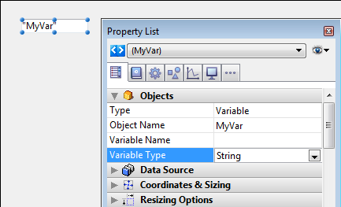

Data in 4D is stored in two fundamentally different ways. **Fields** store data permanently on disk; **variables and arrays** store data temporarily in memory.

When you set up your 4D database, you specify the names and types of fields that you want to use. Variables or arrays are much the same—you also give them names and different types (see [Data types](Concepts/data-types.md)).

Variables and arrays are very similar language elements. A **variable** stores single data. An **array** is an ordered series of **variables** of the same type. Each variable is called an **element** of the array. An array is given its size when it is created; you can then resize it as many times as needed by adding, inserting, or deleting elements, or by resizing the array using the same command used to create it. Array elements are numbered from 1 to N, where N is the size of the array. An array always has an element zero that you can access just like any other element of the array, but this element is not shown when an array is present in a form. Although the element zero is not shown when an array supports a form object, there is no restriction in using it with the language. Arrays are 4D variables. Like any variable, an array has a scope and follows the rules of the 4D language, though with some unique differences. 

Variables and arrays are language objects; you can create and use variable and arrays that will never appear on the screen. 

In your forms, you can display variables or arrays (except Pointer and BLOB) on the screen, enter data into them, and print them in reports. In this way, enterable and non-enterable area variables act just like fields, and the same built-in controls are available when you create them. Form variables can also control buttons, list boxes, scrollable areas, picture buttons, and so on, or display results of calculations that do not need to be saved.  

## Creating Variables   

You create variables by declaring them using one of the "Compiler" theme commands. For example, if you want to define a text variable, you write:

```
 C_TEXT(myText)
```

**Note:** Also it is usually not recommended, you can create variables simply by using them; you do not necessarily need to formally define them as you do with fields. For example, if you want to create a variable that will hold the current date plus 30 days, you can write:

```
 MyDate:=Current date+30 //MyDate is created and gets the current date plus 30 days
```

Once created, you can use a variable wherever you need it in your database. For example, you might need to store the text variable in a field of same type:

```
 [MyTable]MyField:=MyText
```

The following are some basic variable declarations:

```
 C_BLOB(vxMyBlob) // The process variable vxMyBlob is declared as a variable of type BLOB
 C_BOOLEAN(<>OnWindows) // The interprocess variable <>OnWindows is declared as a variable of type Boolean
 C_DATE($vdCurDate) // The local variable $vdCurDate is declared as a variable of type Date
 C_LONGINT(vg1;vg2;vg3) // The 3 process variables vg1, vg2 and vg3 are declared as variables of type longint
```

## Creating Arrays 

You create an array with one of the array declaration commands from the "Array" theme. Each array declaration command can create or resize one-dimensional or two-dimensional arrays. For more information about two-dimensional arrays, see the XXX section.

The following line of code creates (declares) an Integer array of 10 elements:

```
 ARRAY INTEGER(aiAnArray;10)
```

Then, the following code resizes that same array to 20 elements:
```
ARRAY INTEGER(aiAnArray;20)
```

Then, the following code resizes that same array to no elements:
```
ARRAY INTEGER(aiAnArray;0)
```


## Assigning Data

Data can be put into and copied out of variables and arrays. Putting data into a variable is called **assigning the data to the variable** and is done with the assignment operator (:=). The assignment operator is also used to assign data to fields.

The assignment operator is the primary way to create a variable and to put data into it. You write the name of the variable that you want to create on the left side of the assignment operator. For example:

```
MyNumber:=3
```

creates the variable _MyNumber_ and puts the number 3 into it. If MyNumber already exists, then the number 3 is just put into it.

Of course, variables would not be very useful if you could not get data out of them. Once again, you use the assignment operator. If you need to put the value of MyNumber in a field called [Products]Size, you would write _MyNumber_ on the right side of the assignment operator:

```
[Products]Size:=MyNumber
```

In this case, _[Products]Size_ would be equal to 3. This example is rather simple, but it illustrates the fundamental way that data is transferred from one place to another by using the language.


You reference the elements in an array by using curly braces ({…}). A number is used within the braces to address a particular element; this number is called the element number. The following lines put five names into the array called atNames and then display them in alert windows:

```
 ARRAY TEXT(atNames;5)
 atNames{1}:="Richard"
 atNames{2}:="Sarah"
 atNames{3}:="Sam"
 atNames{4}:="Jane"
 atNames{5}:="John"
 For($vlElem;1;5)
    ALERT("The element #"+String($vlElem)+" is equal to: "+atNames{$vlElem})
 End for
```
Note the syntax atNames{$vlElem}. Rather than specifying a numeric literal such as atNames{3}, you can use a numeric variable to indicate which element of an array you are addressing. Using the iteration provided by a loop structure (**For...End for**, **Repeat...Until** or **While...End while**), compact pieces of code can address all or part of the elements in an array.

**Important:** Be careful not to confuse the assignment operator (:=) with the comparison operator, equal (=). Assignment and comparison are very different operations. 


#### Assigning an array to another array 
Unlike text or string variables, you cannot assign one array to another. To copy (assign) an array to another one, use **COPY ARRAY**.


## Local, Process, and Interprocess

You can create three types of variables and arrays: **local**, **process**, and **interprocess**. The difference between the three types of elements is their scope, or the objects to which they are available.

### Local variables or arrays

A local variable is, as its name implies, local to a method—accessible only within the method in which it was created and not accessible outside of that method. Being local to a method is formally referred to as being “local in scope.” Local variables are used to restrict a variable so that it works only within the method.

You may want to use a local variable to:

- Avoid conflicts with the names of other variables
- Use data temporarily
- Reduce the number of process variables

The name of a local variable always starts with a dollar sign ($) and can contain up to 31 additional characters. If you enter a longer name, 4D truncates it to the appropriate length.

When you are working in a database with many methods and variables, you often find that you need to use a variable only within the method on which you are working. You can create and use a local variable in the method without worrying about whether you have used the same variable name somewhere else.

Frequently, in a database, small pieces of information are needed from the user. The command can obtain this information. It displays a dialog box with a message prompting the user for a response. When the user enters the response, the command returns the information the user entered. You usually do not need to keep this information in your methods for very long. This is a typical way to use a local variable. Here is an example:

```
 $vsID:=Request("Please enter your ID:")
 If(OK=1)
    QUERY([People];[People]ID =$vsID)
 End if
```

This method simply asks the user to enter an ID. It puts the response into a local variable, $vsID, and then searches for the ID that the user entered. When this method finishes, the $vsID local variable is erased from memory. This is fine, because the variable is needed only once and only in this method.

**Note:** Parameters $1, $2... passed to methods are local variables. For more information, please refer to **Parameters**.

### Process variables or arrays

A process variable is available only within a process. It is accessible to the process method and any other method called from within the process.

A process variable does not have a prefix before its name. A process variable name can contain up to 31 characters.

In interpreted mode, variables are maintained dynamically; they are created and erased from memory “on the fly.” In compiled mode, all processes you create (user processes) share the same definition of process variables, but each process has a different instance for each variable. For example, the variable myVar is one variable in the process P_1 and another one in the process P_2.

A process can “peek and poke” process variables from another process using the commands **GET PROCESS VARIABLE** and **SET PROCESS VARIABLE**. It is good programming practice to restrict the use of these commands to the situation for which they were added to 4D:

- Interprocess communication at specific places or your code
- Handling of interprocess drag and drop
- In Client/Server, communication between processes on client machines and the stored procedures running on the server machines

For more information, see the chapter **Processes** and the description of these commands.

### Interprocess variables or arrays

Interprocess variables are available throughout the database and are shared by all processes. They are primarily used to share information between processes.

The name of an interprocess variable always begins with the symbols (<>) — a “less than” sign followed by a “greater than” sign— followed by 31 characters.

In Client/Server, each machine (Client machines and Server machine) share the same definition of interprocess variables, but each machine has a different instance for each variable.


## Form Object Variables

In the Form editor, each active object—button, radio button, check box, scrollable area, meter bar, and so on—is identified by an object name and is automatically associated with a variable (or expression). By default, the variable is not defined when the object is created: it will be created dynamically when the form is loaded (see below). You can, if you want, name the variable in the Property List to create it. For example, if you create a button named MyButton, you can associated it with a MyButton variable (you can also use the same name as the object).

The form object variables allow you to control and monitor the objects. For example, when a button is clicked, its variable is set to 1; at all other times, it is 0. The variable associated with a meter or dial lets you read and change the current setting. For example, if you drag a meter to a new setting, the value of the variable changes to reflect the new setting. Similarly, if a method changes the value of the variable, the meter is redrawn to show the new value.

For more information about variables and forms, see the 4D Design Reference Manual as well as the chapter Form Events.

## Dynamic variables

You can leave it up to 4D to create variables associated with your form objects (buttons, enterable variables, check boxes, etc.) dynamically and according to your needs. To do this, simply leave the "Variable Name" field blank in the Property list for the object:



When a variable is not named, when the form is loaded, 4D creates a new variable for the object, with a calculated name that is unique in the space of the process variables of the interpreter (which means that this mechanism can be used even in compiled mode). This temporary variable will be destroyed when the form is closed.
In order for this principle to work in compiled mode, it is imperative that dynamic variables are explicitly typed. There are two ways to do this:

- You can set the type using the "Variable Type" menu of the Property list.
**Note:** When the variable is named, the "Variable Type" menu does not actually type the variable but simply allows the options of the Property list to be updated (except for picture variables). In order to type a named variable, it is necessary to use the commands of the Compiler theme.
- You can use a specific initialization code when the form is loaded that uses, for example, the **VARIABLE TO VARIABLE** command:

```
     If(Form event=On Load)
        C_TEXT($init)
        $Ptr_object:=OBJECT Get pointer(Object named;"comments")
        $init:=""
        VARIABLE TO VARIABLE(Current process;$Ptr_object->;$init)
     End if
```

**Note:** If you specify a dynamic variable, select the value **Non**e in the "Variable Type" menu, and do not use initialization code, a typing error will be returned by the compiler.

In the 4D code, dynamic variables can be accessed using a pointer obtained with the command. For example:

```
  // assign the time 12:00:00 to the variable for the "tstart" object
 $p :=OBJECT Get pointer(Object named;"tstart")
 $p->:=?12:00:00?
```

There are two advantages with this mechanism:

- On the one hand, it allows the development of "subform" type components that can be used several times in the same host form. Let us take as an example the case of a datepicker subform that is inserted twice in a host form to set a start date and an end date. This subform will use objects for choosing the date of the month and the year. It will be necessary for these objects to work with different variables for the start date and the end date. Letting 4D create their variable with a unique name is a way of resolving this difficulty.
- On the other hand, it can be used to limit memory usage. In fact, form objects only work with process or inter-process variables. However, in compiled mode, an instance of each process variable is created in all the processes, including the server processes. This instance takes up memory, even when the form is not used during the session. Therefore, letting 4D create variables dynamically when loading the forms can economize memory.

**Note:** When there is no variable name, the object name is shown in quotation marks in the form editor (when the object display a variable name by default).

## About Arrays

### Using the element zero of an array 

An array always has an element zero. While element zero is not shown when an array supports a form object, there is no restriction(*) in using it with the language.

One example of the use of element zero is the case of the combo box discussed in the **CLOSE DOCUMENT** section.

Here is another example: you want to execute an action only when you click on an element other than the previously selected element. To do this, you must keep track of each selected element. One way to do this is to use a process variable in which you maintain the element number of the selected element. Another way is to use the element zero of the array:

```
  ` atNames scrollable area object method
 Case of
    :(Form event=On Load)
  ` Initialize the array (as shown further above)
       ARRAY TEXT(atNames;5)
  ` ...
  ` Initialize the element zero with the number
  ` of the current selected element in its string form
  ` Here you start with no selected element
       atNames{0}:="0"
 
    :(Form event=On Unload)
  ` We no longer need the array
       CLEAR VARIABLE(atNames)
 
    :(Form event=On Clicked)
       If(atNames#0)
          If(atNames#Num(atNames{0}))
             vtInfo:="You clicked on: "+atNames{atNames}+" and it was not selected before."
             atNames{0}:=String(atNames)
          End if
       End if
    :(Form event=On Double Clicked)
       If(atNames#0)
          ALERT("You double clicked on: "+atNames{atNames}
       End if
 End case
```
 
(*) However, there is one exception: in an array type List Box, the zero element is used internally to store the previous value of an element being edited, so it is not possible to use it in this particular context.


### Two-dimensional Arrays 

Each of the array declaration commands can create or resize one-dimensional or two-dimensional arrays. Example:

```
 ARRAY TEXT(atTopics;100;50) ` Creates a text array composed of 100 rows of 50 columns
```

Two-dimensional arrays are essentially language objects; you can neither display nor print them.

In the previous example:

- atTopics is a two-dimensional array
- atTopics{8}{5} is the 5th element (5th column...) of the 8th row
- atTopics{20} is the 20th row and is itself a one-dimensional array
- (atTopics) returns 100, which is the number of rows
- (atTopics{17}) returns 50, which the number of columns for the 17th row

In the following example, a pointer to each field of each table in the database is stored in a two-dimensional array:

```
 C_LONGINT($vlLastTable;$vlLastField)
 C_LONGINT($vlFieldNumber)
  ` Create as many rows (empty and without columns) as there are tables
 $vlLastTable:=Get last table number
 ARRAY POINTER(<>apFields;$vlLastTable;0) `2D array with X rows and zero columns
  ` For each table
 For($vlTable;1;$vlLastTable)
    If(Is table number valid($vlTable))
       $vlLastField:=Get last field number($vlTable)
  ` Give value of elements
       $vlColumnNumber:=0
       For($vlField;1;$vlLastField)
          If(Is field number valid($vlTable;$vlField))
             $vlColumnNumber:=$vlColumnNumber+1
  `Insert a column in a row of the table underway
             INSERT IN ARRAY(<>apFields{$vlTable};$vlColumnNumber;1)
  `Assign the "cell" with the pointer
             <>apFields{$vlTable}{$vlColumnNumber}:=Field($vlTable;$vlField)
          End if
       End for
    End if
 End for
```

Provided that this two-dimensional array has been initialized, you can obtain the pointers to the fields for a particular table in the following way:

```
  ` Get the pointers to the fields for the table currently displayed at the screen:
 COPY ARRAY(◊apFields{Table(Current form table)};$apTheFieldsIamWorkingOn)
  ` Initialize Boolean and Date fields
 For($vlElem;1;Size of array($apTheFieldsIamWorkingOn))
    Case of
       :(Type($apTheFieldsIamWorkingOn{$vlElem}->)=Is date)
          $apTheFieldsIamWorkingOn{$vlElem}->:=Current date
       :(Type($apTheFieldsIamWorkingOn{$vlElem}->)=Is Boolean)
          $apTheFieldsIamWorkingOn{$vlElem}->:=True
    End case
 End for
```

**Note:** As this example suggests, rows of a two-dimensional arrays can be the same size or different sizes.

### Arrays and Memory

Unlike the data you store on disk using tables and records, an array is always held in memory in its entirety.

For example, if all US zip codes were entered in the [Zip Codes] table, it would contain about 100,000 records. In addition, that table would include several fields: the zip code itself and the corresponding city, county, and state. If you select only the zip codes from California, the 4D database engine creates the corresponding selection of records within the [Zip Codes] table, and then loads the records only when they are needed (i.e., when they are displayed or printed). In order words, you work with an ordered series of values (of the same type for each field) that is partially loaded from the disk into the memory by the database engine of 4D.

Doing the same thing with arrays would be prohibitive for the following reasons:

- In order to maintain the four information types (zip code, city, county, state), you would have to maintain four large arrays in memory.
- Because an array is always held in memory in its entirety, you would have to keep all the zip codes information in memory throughout the whole working session, even though the data is not always in use.
- Again, because an array is always held in memory in its entirety, each time the database is started and then quit, the four arrays would have to be loaded and then saved on the disk, even though the data is not used or modified during the working session.

**Conclusion:** Arrays are intended to hold reasonable amounts of data for a short period of time. On the other hand, because arrays are held in memory, they are easy to handle and quick to manipulate.

However, in some circumstances, you may need to work with arrays holding hundreds or thousands of elements. The following table lists the formulas used to calculate the amount of memory used for each array type:

|Array Type	|Formula for determining Memory Usage in Bytes|  
|---|---|
|Boolean|(31+number of elements)\8
|Date	|(1+number of elements) * 6
|String	|(1+number of elements) * (Sum of the size of each text)
|Integer	|(1+number of elements) * 2
|Long Integer	|(1+number of elements) * 4
|Picture	|(1+number of elements) * 4 + Sum of the size of each picture
|Pointer	|(1+number of elements) * 16
|Real	|(1+number of elements) * 8
|Text	|(1+number of elements) * (Sum of the size of each text)
|Two-dimensional	|(1+number of elements) * 12 + Sum of the size of each array

**Notes:**

- The size of a text in memory is calculated using this formula: ((Length + 1) * 2)
- A few additional bytes are required to keep track of the selected element, the number of elements, and the array itself.

When working with very large arrays, the best way to handle full memory situations is to surround the creation of the arrays with an project method. Example:

```
  ` You are going to run a batch operation the whole night
  ` that requires the creation of large arrays. Instead of risking
  ` occurrences of errors in the middle of the night, put
  ` the creation of the arrays at the beginning of the operation
  ` and test the errors at this moment:
 gError:=0 ` Assume no error
 ON ERR CALL("ERROR HANDLING") ` Install a method for catching errors
 ARRAY STRING(63;asThisArray;50000) ` Roughly 3125K in ASCII mode
 ARRAY REAL(arThisAnotherArray;50000) ` 488K
 ON ERR CALL("") ` No longer need to catch errors
 If(gError=0)
  ` The arrays could be created
  ` and let's pursue the operation
 Else
    ALERT("This operation requires more memory!")
 End if
  ` Whatever the case, we no longer need the arrays
 CLEAR VARIABLE(asThisArray)
 CLEAR VARIABLE(arThisAnotherArray)
```

The _ERROR HANDLING_ project method is listed here:

```
  ` ERROR HANDLING project method
 gError:=Error ` Just return the error code
```


## System Variables

4D maintains a number of variables called **system variables**. These variables let you monitor many operations. System variables are all process variables, accessible only from within a process.

The most important system variable is the OK system variable. As its name implies, it tells you if everything is OK in the particular process. Was the record saved? Has the importing operation been completed? Did the user click the OK button? The OK system variable is set to 1 when a task is completed successfully, and to 0 when it is not.

For more information about system variables, see the section **System Variables**.

